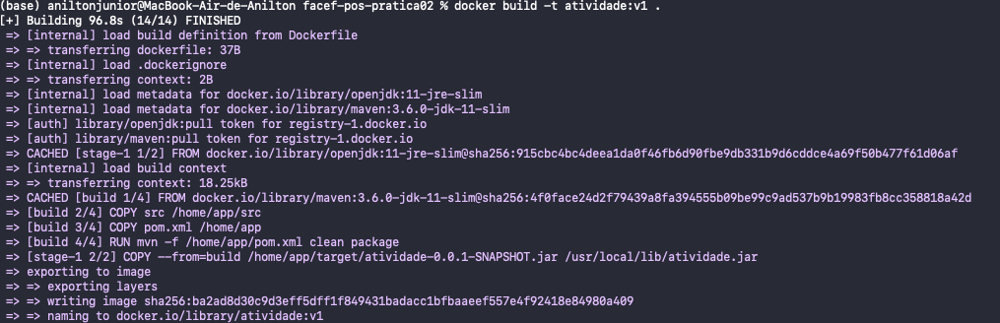
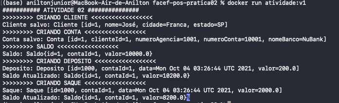

# facef-pos-pratica02
Trabalho da matéria de Técnica e Fundamentos da Pós de Desenvolvimento de Aplicativos Web e Móveis escaláveis

# Geração da imagem do docker

- Comando para geração



# Executando container

- Comando para executar

```shell
docker run atividade:v1
```
- Saída esperada

